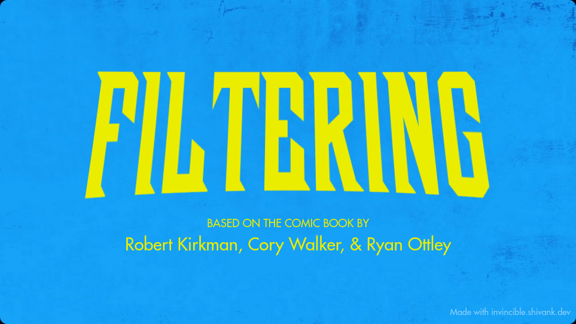

# Step 4: Knowing Your Location
outline:
- talks Abt odo, diffy odo implementation, link to odo part of vision guide 
- talk abt odo limitations / drift 

- talk Abt April tags,how they can  help, link to PNP reading maybe 
- link to second part of vision tutorial, pose estimator 
- talk Abt limelight , limelghtlib
- ~~maybe make nt tutorial?~~
- talk Abt optionals in context of vision 
- ambiguity, link to wpuliv image 
### Ambiguity
- techniques to get around ambiguit
- built in
     - mt1 / multitag
         - works w photon too
     - mt2 / gyro correction 
         - technically works w photon, better perf w LL
         - needs solid gyro pose, so needs either good setup or sum tech
 - filtering
     - bad poses are obv wrong 
        - puts you positive z
        - puts u outside the field 
    - ambiguity ratio 

   

## Odometry 
- uses wheel / motor positions to calculate your position on the field
let's start by adding odometry capability to the minibot. 
1. Follow [this guide](Supplementals/Vision%20Tutorial.md#odometry) and set up a `DifferentialDriveOdometry` object for your drivetrain 
2. Tips for the update() function
    1. you need to find the distance each wheel has traveled using the position of the motor.
        1. the wheel radius is 2 in
    2. to use the gyro follow [this guide to setup the gyro](Supplementals/Obscure%20Devices%20Setup%20Guide#ADIS%20gyro%20(minibot%20gyro))
3. use [DogLog](Supplementals/Obscure%20Devices%20Setup%20Guide#DogLog) if you don't have advantagekit set up yet to log the resulting pose
    1. save the result of the update() function to a variable in periodicIO
    2. install DogLog from the vendor library tab in wpilib
    3. use `DogLog.log(String key, Pose2d pose)` to log the pose variable 
    4. you can see the pose in advantage scope, and drag it to a 2d or 3d field to visualize it 
4. Drive around for a bit, see if your conversion math was right using a ruler

## Limitations of Odometry

Unfortunately, odometry on its own is pretty bad. It can easily be fucked up by:
- Accelerating hard
- hitting another robot
- anything else that lets the wheels spin without moving the robot 
The odometry being accurate relies on the wheels spinning properly

That's why April tags exist, and we can use the Limelight to calculate our position from the tag. Then, we use that pose to correct our odometry.

>[!INFO]
> if you want more info about exactly how reading position from april tags work, you can read [this wikepedia page or sum ikd](https://en.wikipedia.org/wiki/Perspective-n-Point) but it's not really required

## Limelight Quick Start
The minibot has a limelight on it, which is basically a camera w/ a computer attached, and it does the math for calculating pose for us.

**Accessing Limelight Poses**
1. get the limelight library
	1. it's just a file called `LimelightHelpers.java`, copy it from `team3647/lib/vision` in the most recent robot code repo
2. to use it, use `LimelightHelpers.getBotPose2d_wpiBlue("")` and log the result using doglog (or akit if it's set up).
3. Profit (when you point it at a tag, a pose2d should show up )
remember, ask for help if you have problems, there are no dumb questions
## Integrating vision with Odometry
unfortunately, we can't always be looking at apriltags in real matches, so we still need odometry to fill in the gaps when we can't see any tags 

**therefore we need to integrate the vision estimates with odometry** 

we will use a Kalman Filter to do this 
- essentially, a kalman filter will smooth the transition from odometry to vision, and apply a different amount of correction based on how much we trust the vision pose.
>[!INFO]
> for more detail, you can google it

let's upgrade our `DifferentialDriveOdometry` to be able to take vision measurements

follow [this guide](Supplementals/Vision%20Tutorial.md#adding%20vision) to turn the odometry object into a pose estimator.

- you should now notice your odometry slowly shifts towards your vision pose. 
**if it doesn't, ask for help, and fix it before moving on**

- However, the getPose2D function returns (0,0,0) when it doesn't see anything, and we don't want our robot's pose drifting to 0 all the time, so we need

## Filtering

This is a way of catching obviously wrong poses before they get to the pose estimator. 

There are a few ways to do this

1. 0 Poses
	1. the default for when there's no visible tag, so its obv wrong
2. field boundary
	1. if the pose thinks you're not in the field, it can't be right
3. z check
	1. if the pose puts you up in the air, it can't be correct
there are a few more, and I'll cover them later

for now, implement these filters however you want, but eventually, in step 6, I'll show you the structure of how they're implemented in our code

Now let's talk about getting better pose estimates in the first place, and how poses can be wrong

## Ambiguity

This is pose Ambiguity:

See how the same 2d shape (top) can lead to two very different 3d projections. (bottom) This is bad. In the limelight/photonvision system, you'll see this as the 3d projections rapidly switching between these two states, and the pose switching in turn

### Fixing Ambiguity
Some of the filtering I mentioned earlier can help w this problem, cuz it's likely that the wrong state will be obvious.

However, that would cut the amount of estimates that you have in half, which decreases the performance of the pose estimator

There are two goals for pose estimation
1. get a pose that's correct
2. get as many correct estimates as possible 
filtering ambiguous poses fulfills the first goal, but not the second.
So how do we correct ambiguity and also keep many estimates?

#### Weird Angles

- if the cameras are mounted at oblique (weird) angles to the tag, instead of looking straight at it, the chance that we get a wrong pose is reduced.
- this is *the most effective and simple way to reduce ambiguity* 
- remember: **TALK TO DESIGNERS OF YOUR ROBOT TO GET WHAT YOU WANT**
	- good communication with the design team is *super important* 
	- otherwise you might be stuck with a shitty vision system that you can't really do much to fix
	- this goes for other things too, like long chain runs/reducing backlash (separate topic)

#### Multitag/MT1
if you see two tags in the same frame, the vision system can resolve them together to *significantly* reduce ambiguity
- on LL this is called Megatag 1 or MT1
- on Photonvision this is called Multitag, and needs to be enabled in code and on the orangePi (more on this later)

#### Gyro Correction/MT2
we can also use the gyro to choose which pose is the right one in an ambiguous situation
- this is called MegaTag2 (MT2) in Limelight, and also exists in photonvision (but is run on the roborio so we don't use it on PV)

- this can lead to extremely stable/confident but also extremely wrong poses
- make sure gyro angles are correct before using MT2